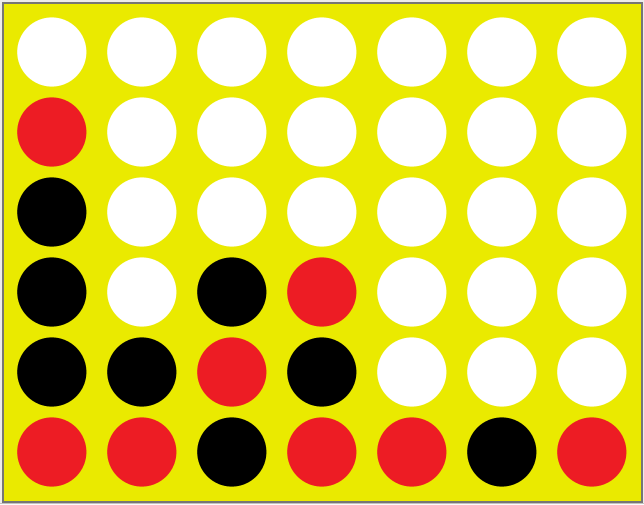

# Connect Four Game

This is a simple implementation of the Connect Four game using object-oriented programming in JavaScript.



## Features

- Interactive gameplay: Players can take turns dropping colored discs into a grid and aim to connect four discs of their color in a row, column, or diagonal to win the game.
- Two-player mode: Play against a friend on the same device and take turns making moves.
- Dynamic board size: The game board can be customized to have different widths and heights.
- Visual feedback: The game provides visual cues for player turns, valid moves, and win/tie conditions.

## Getting Started

To get a local copy of the project up and running, follow these steps:

1. Clone the repository:

`git clone https://github.com/JaydotMurf/connect-four-oo.git`

2. Open the `index.html` file in your web browser.

3. Start playing Connect Four!

## How to Play

1. The game starts with Player 1 (red) making the first move.

2. Players take turns dropping their colored discs into any of the available columns.

3. The goal is to connect four discs of the same color either vertically, horizontally, or diagonally.

4. The game ends when either player achieves a winning combination or the board is completely filled with no winner (a tie).

5. To start a new game, click the "Reset" button.

## Customizing the Game

You can customize the game by adjusting the size of the game board. By default, the board has a width of 7 columns and a height of 6 rows. To change the size, modify the `WIDTH` and `HEIGHT` variables in the `Game` object in the `script.js` file.

```javascript
const game = {
  WIDTH: 7,
  HEIGHT: 6,
  // ...
};
```

Feel free to experiment with different sizes to create a unique gameplay experience!
Technologies Used

    HTML5
    CSS3
    JavaScript (ES6)

Credits

This project is based on the Connect Four game example from the SpringBoard Front-End Developer boot camp.

License

This project is licensed under the MIT License.
